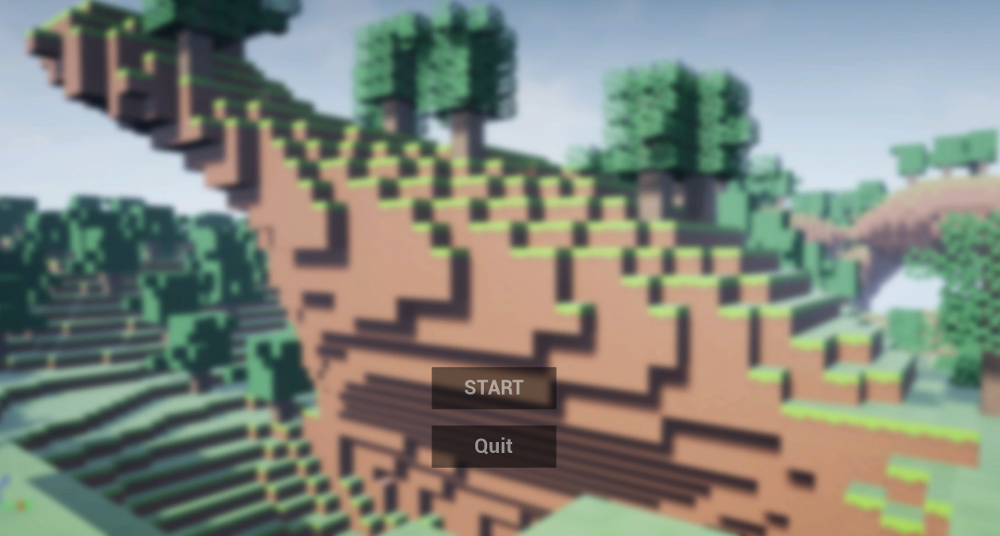

# Portfolio_Game2
언리얼엔진을 이용한 게임 프로그래밍  

마인크래프트의 기능 중 블록을 부수고 배치할 수 있는 기능을 만든 게임입니다.

---

Main Menu에서 Start를 통해 시작할 수 있고, Quit를 통해 종료할 수 있습니다.

## 블록 부수기

블록을 향해 마우스 왼클릭을 하게되면 블록이 부서지게 된다.

## 블록 배치하기

우클릭을 하게되면 해당되는 위치에 블록이 생성된다.  
퀵슬롯에 해당하는 블록이 배치된다.

## 인벤토리

인벤토리에 블록을 넣어둘 수 있고 퀵슬롯에 블록을 넣을 수 있다

## 맵

Noise 함수를 이용해서 맵이 불규칙적인 형태로 생성되도록 했다. 
그리고 보이지 않는 블럭은 그리지 않도록 청크단위로 관리했다.

동굴은 지면 아래에 랜덤한 형태로 생성된다.

밤과 낮이 시간에 따라 변한다.

플레이어의 위치에 따라 청크단위로 삭제/생성된다.  
(영상은 임의로 플레이어 주변 청크가 조금만 생성되게 한 후 촬영하였습니다)

 

---

## Resource Pack
[Sapixcraft](https://sapixcraft.com/index)

[The Find!](https://www.planetminecraft.com/texture_pack/the-find/)

## Perlin Noise Function
[SimplexNoise](https://github.com/devdad/SimplexNoise)

## Font
[배달의민족 주아](http://font.woowahan.com/jua/)
