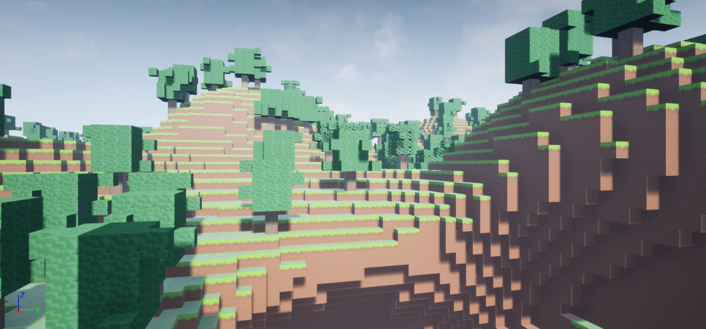
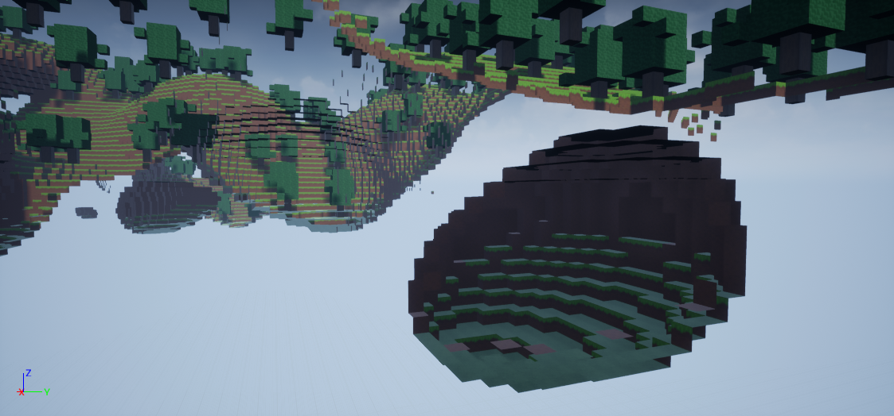

# Portfolio_Game2
언리얼엔진을 이용한 게임 프로그래밍  

마인크래프트의 기능 중 블록을 부수고 배치할 수 있는 기능을 만든 게임입니다.

---
## 블록 부수기

블록을 향해 마우스 왼클릭을 하게되면 블록이 부서지게 된다.

## 블록 배치하기

우클릭을 하게되면 해당되는 위치에 블록이 생성된다.  
퀵슬롯에 해당하는 블록이 배치된다.

## 인벤토리

인벤토리에 블록을 넣어둘 수 있고 퀵슬롯에 블록을 넣을 수 있다

## 맵

Noise 함수를 이용해서 맵이 불규칙적인 형태로 생성되도록 했다. 
그리고 보이지 않는 블럭은 그리지 않도록 청크단위로 관리했다.

동굴은 지면 아래에 랜덤한 형태로 생성된다.

---

## Resource Pack
[Sapixcraft](https://sapixcraft.com/index)

## Perlin Noise Function
[SimplexNoise](https://github.com/devdad/SimplexNoise)

